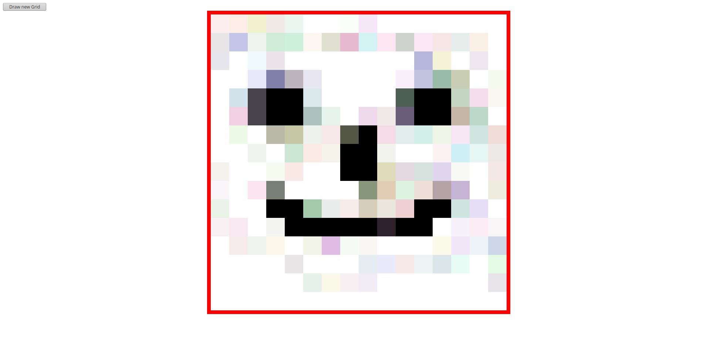

# Etch a sketch

My second JavaScript project on the Foundations curriculum at [The Odin Project](https://www.theodinproject.com). The application creates a drawing surface reminiscent of an [Etch A Sketch](https://en.wikipedia.org/wiki/Etch_A_Sketch). The drawing surface consists of `
` elements that are created with two nested for-loops. On mouseover, each `
` is filled with a random color at 10% opacity. Each time one hovers over a `
` the opacity and darkness of the color are increased until the square becomes black. A button enables creating a new drawing surface with a custom "resolution". The number entered into the prompt denotes the number of `
`'s per row. This number is limited to 150 because of performance issues.

## Reflection

- The project was much fun and I was surprised by how little code is actually necessary to make something like this work. Maybe I'll come back to it in the future and add a bit more functionality (for example, it would be cool to choose between different colors for painting).
- The optional part, which included adding more and more black to a (random) rgb-color, was quite a hard bit, but a google-search yielded the answer on stackoverflow.

## Demo

[View it here](https://reinimax.github.io/etch-a-sketch/)
